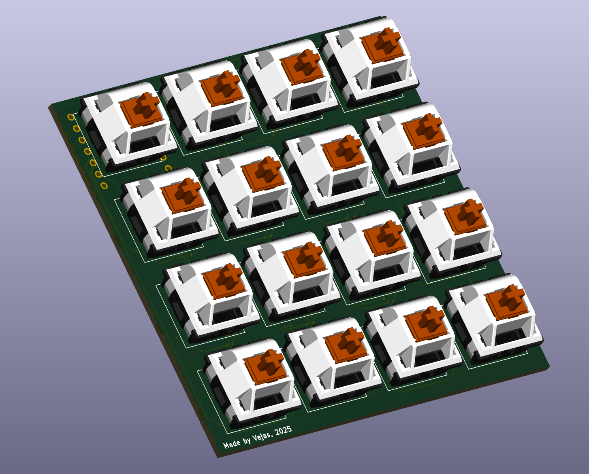

## September 6th: Starting and in theory finishing.

I started this project and decided to make a 16 key macropad. I layed it out in a 4x4 layout. This time I wanted to try out something new and cram the rp2040 on the back side opposite a key switch.

I am taking this approach so that my macropad would be a perfect square, and because I got tired of the big ugly lip everyone has at the top.

I put the MCU behind the first switch so the usb port would be in a nice place.
I used sod diodes because they are smaller (I know ironic huh) but also I won’t have a bunch of holes I have to worry about, and clearance under the rp2040.

I will be using some type of MX switch.

## September 7th: Fighting people about my design + 3D Case

A lot of people on the HackClub Slack have been skeptical on how I have placed the Xiao. 
I myself think its a great design choice, that won’t interfere with any other component because, in theory with pin headers commonly being 2 mm tall, I should have enough clearance to fit my components on the top and bottom part of the pcb with just enough to spare so that the RP2040 wouldn’t be touching anything.

| PCB with populated switches   | Clearance (Pin headers accounted for)|
|-------------------------------|--------------------------------|
|      |    |