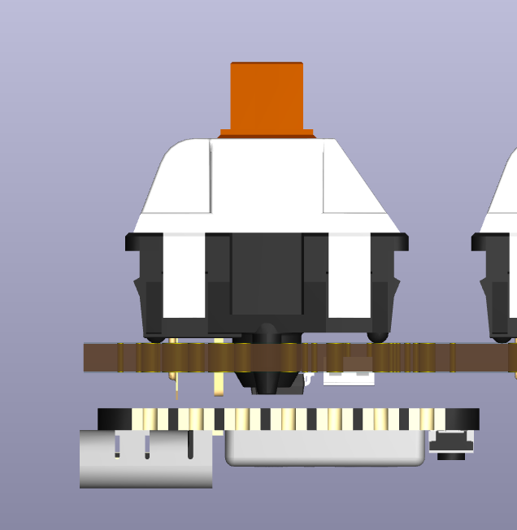
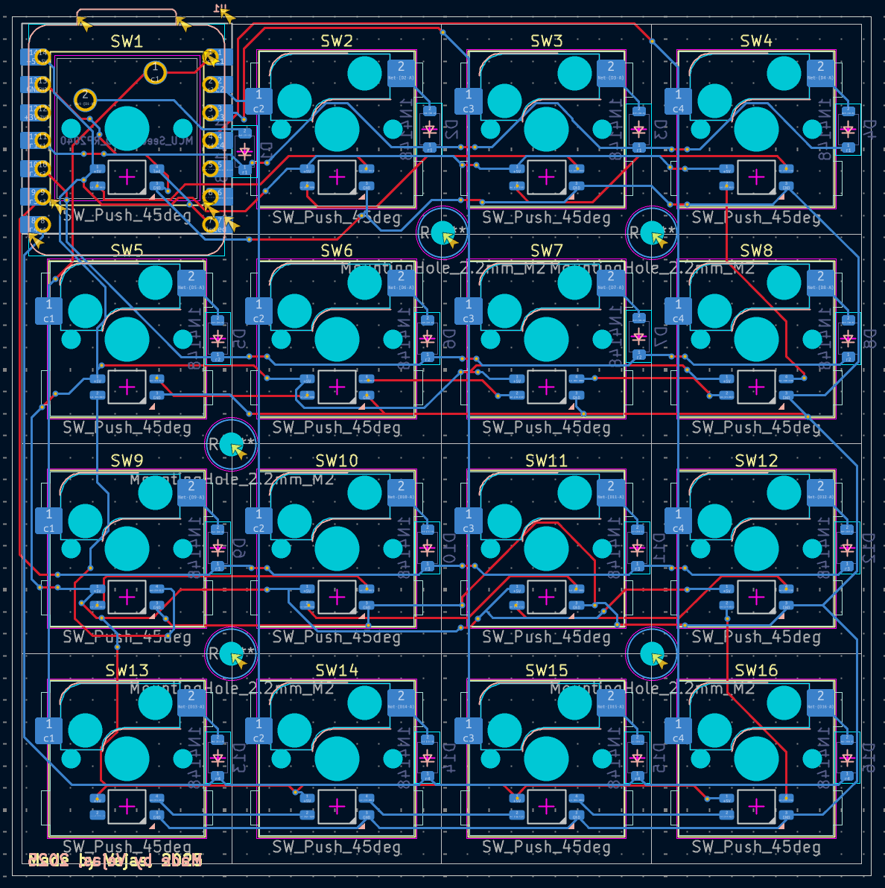

## September 6th: Starting and in theory finishing.

I started this project and decided to make a 16 key macropad. I layed it out in a 4x4 layout. This time I wanted to try out something new and cram the rp2040 on the back side opposite a key switch.

I am taking this approach so that my macropad would be a perfect square, and because I got tired of the big ugly lip everyone has at the top.

I put the MCU behind the first switch so the usb port would be in a nice place.
I used sod diodes because they are smaller (I know ironic huh) but also I won’t have a bunch of holes I have to worry about, and clearance under the rp2040.

I will be using some type of MX switch.

## September 7th: Fighting people about my design + 3D Case

A lot of people on the HackClub Slack have been skeptical on how I have placed the Xiao. 
I myself think its a great design choice, that won’t interfere with any other component because, in theory with pin headers commonly being 2 mm tall, I should have enough clearance to fit my components on the top and bottom part of the pcb with just enough to spare so that the RP2040 wouldn’t be touching anything.

| PCB with populated switches   | Clearance (Pin headers accounted for)|
|-------------------------------|--------------------------------|
|      |    |

### 3D Case

I have also added a case to house the bottom pcb, but I do not think a top plate or case is really necessary at the moment.

 

I also decided that I will be using white keycaps for the leds to shine on. 

# September 8 + 9 - New case + change of mind

I watched a guide on how to make a case for your keyboard by ScottoKeebs (which is an amazing video).
I then made a case in Shapr3d trying to incorporate some M2.5 screws that I have left over from another build, but I will have to buy some standoffs for this keyboard.

This also included me adding holes in my pcb for screws.

- 23:47
	- I had the bright idea of changing all my switches (except the top left) to hotswappable ones...
	- This ensued a lot of rewiring and adjustments.
	- I also changed the m2.5 screws to m2 screws because they just fit better.

- 05:48
	- Finished my overhaul, with like 5 hrs of sleep in that. 15 of 16 switches are now Hotswappable, with the very first switch getting constrained by the Xiao.
    - Added 5 mounting holes in the pcb but idk how its gonna be mounted with my plate, because there will be standoffs resting below… so I guess we’ll see abt that but I can always tweak the case design and reprint it in my local maker space.

    -  
- 06:18
	- Exporting all files, getting ready for submission.
- 06:57
  	- Very last changes, Gerbers, silkscreen, etc.	

I think this is the end for this project unless I need to change something or I’ll write when I do the software.
(My English teacher would probably have a stroke reading this :skull:)